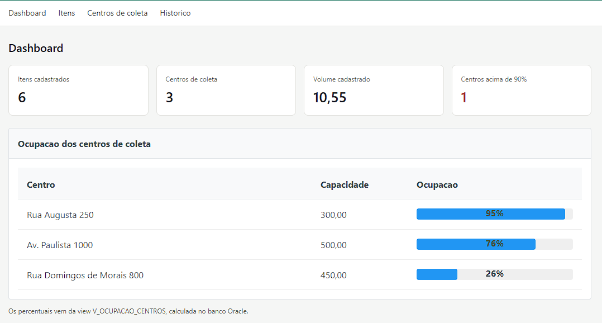
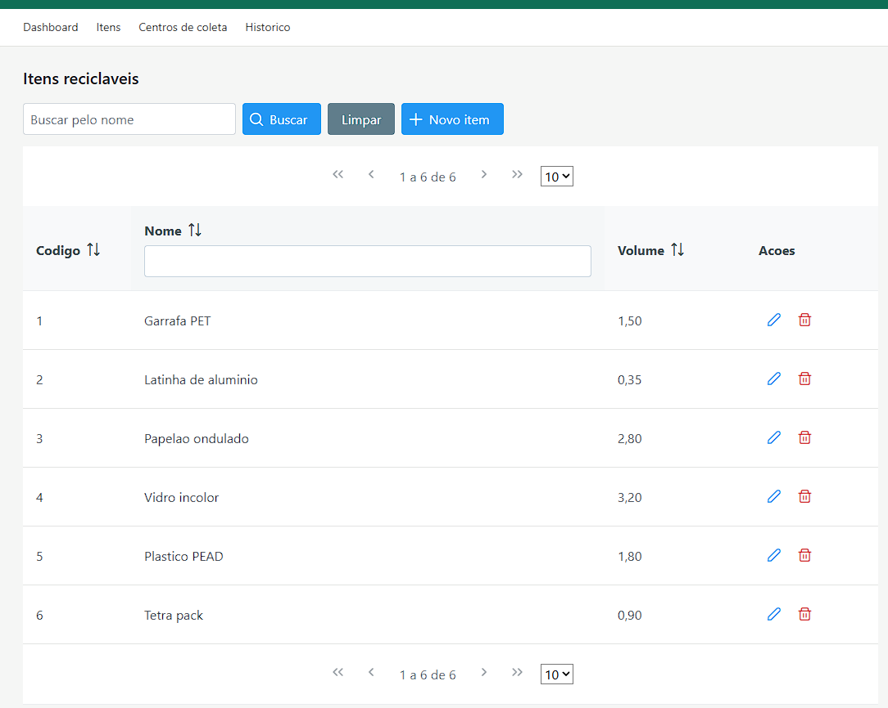
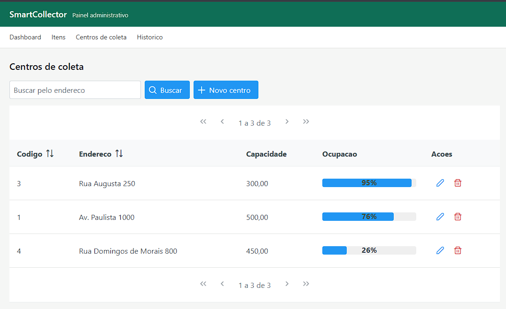

# SmartCollector Admin

[](https://github.com/XavieremJs/SmartCollector-admin/actions/workflows/ci.yml)

Painel administrativo web para o sistema **SmartCollector**, construído com **JSF/PrimeFaces** sobre **Spring Boot** e **Oracle**.

Enquanto a [API REST](./api) — no diretório `api/` deste mesmo repositório — atende as aplicações cliente, este painel é a interface interna de gestão: cadastro de itens recicláveis, gestão dos centros de coleta e acompanhamento de ocupação em tempo real. Ambos leem o mesmo schema Oracle.

```
/          → painel administrativo JSF (este projeto)
/api       → API REST consumida pelas aplicações cliente
```

---

## Stack

- **Java 21** · **Spring Boot 3.4**
- **JSF (Jakarta Faces)** via **JoinFaces 5.3**
- **PrimeFaces 14** — DataTable, Dialog, Chart, ProgressBar
- **Spring Security** — autenticação por formulário e controle de acesso por role
- **Spring Data JPA / Hibernate** sobre **Oracle**
- **PL/SQL** — packages com function, procedure, cursor e tratamento de exceções
- **MySQL** — read model alimentado por outbox transacional
- **Flyway** para migrações versionadas

---

## Arquitetura

JSF é um framework **server-side**: não há frontend separado nem JSON trafegando entre navegador e servidor. O servidor monta o HTML e o devolve pronto — os `#{bean.propriedade}` das páginas `.xhtml` resolvem direto para métodos Java.

```
webapp/*.xhtml        → páginas (componentes PrimeFaces)
bean/                 → managed beans; expõem dados e tratam ações dos botões
service/              → regra de negócio, rotinas PL/SQL e relay do outbox
repository/           → Spring Data JPA sobre Oracle
model/                → entidades JPA (Oracle)
readmodel/model/      → entidades JPA do read model (MySQL)
readmodel/repository/ → consultas do read model
config/               → Spring Security e os dois datasources
db/oracle/            → DDL, packages PL/SQL e outbox
db/mysql/             → schema do read model
```

### Dois bancos, papéis distintos

O sistema separa **escrita** de **leitura** (CQRS):

| | Oracle | MySQL |
|---|---|---|
| Papel | Fonte da verdade | Read model |
| Recebe | Cadastros, coletas, PL/SQL transacional | Apenas projeções de evento |
| Consultado por | Painel de cadastro | Histórico e relatórios |

O motivo é concreto: a consulta "o que este catador coletou neste mês" é uma agregação que ninguém precisa ver com precisão de segundos, e rodá-la no banco transacional competiria com o registro das coletas. O read model já chega desnormalizado e indexado para essa pergunta.

O custo é **consistência eventual** — o histórico atrasa alguns segundos em relação ao Oracle. A tela informa isso ao usuário quando há eventos pendentes.

### Outbox transacional

A parte difícil de dois bancos é não perder eventos. A solução aqui não usa transação distribuída:

**1. Escrita.** A procedure `PRC_REGISTRAR_ENTREGA` grava o evento em `TB_OUTBOX_EVENTO` na **mesma transação** que atualiza o centro e finaliza a coleta. Se a transação faz commit, o evento existe. Se faz rollback, nada existe. Não há janela de inconsistência.

**2. Relay.** Um job agendado lê os eventos pendentes com `FOR UPDATE SKIP LOCKED` — várias instâncias da aplicação podem rodar em paralelo sem processar o mesmo evento duas vezes.

**3. Projeção.** O evento é aplicado no MySQL e só então marcado como `PROCESSADO` no Oracle. Se o processo cair entre as duas etapas, o evento é reentregue.

**4. Idempotência.** A tabela `evento_aplicado` tem o id do evento como chave primária. Uma reentrega é detectada e descartada.

O resultado é entrega **at-least-once com efeito exactly-once**: eventos podem chegar repetidos, mas nunca são aplicados duas vezes e nunca se perdem silenciosamente. Após 5 tentativas o evento vai para `FALHA` com o erro registrado, em vez de bloquear a fila.

## Rotinas PL/SQL

Definidas em `src/main/resources/db/migration/V2__PKG_RELATORIO.sql`.

| Rotina | Tipo | O que faz |
|---|---|---|
| `FN_CAPACIDADE_DISPONIVEL` | Function | Capacidade livre do catador: total menos o volume dos itens ainda não entregues |
| `FN_VOLUME_DA_COLETA` | Function | Soma o volume dos itens que compõem uma coleta |
| `PRC_REGISTRAR_ENTREGA` | Procedure | Registra a entrega da coleta num centro, com trava de linha e validação de espaço |
| `V_OCUPACAO_CENTROS` | View | Percentual de ocupação por centro, consumido pelo gráfico do dashboard |

Chamadas a partir do Java em `RelatorioService` via `CallableStatement` e `JdbcClient`.

---

## Telas

| Tela | Rota | Acesso |
|---|---|---|
| Login | `/login.xhtml` | público |
| Dashboard | `/dashboard.xhtml` | autenticado |
| Itens recicláveis | `/itens.xhtml` | autenticado |
| Centros de coleta | `/centros.xhtml` | apenas `ROLE_ADMIN` |
| Histórico e relatórios | `/historico.xhtml` | autenticado |

### Capturas


*Dashboard com indicadores gerais e ocupação dos centros de coleta, calculada pela view V_OCUPACAO_CENTROS no Oracle.*


*CRUD de itens com DataTable, paginação, filtro por coluna e diálogo modal de edição — tudo via AJAX do PrimeFaces.*


*Gestão dos centros de coleta, com barra de ocupação e validação de capacidade no serviço.*

O CRUD de itens usa `DataTable` com paginação, ordenação, filtro por coluna, diálogo modal de edição e confirmação de exclusão — tudo via AJAX, sem uma linha de JavaScript escrita à mão.

---

## Como executar

Requer Java 21, Maven e uma instância Oracle acessível. As migrações Flyway deste projeto são as donas do schema: rode o painel uma vez e as tabelas, o PL/SQL e o outbox passam a existir para os dois módulos.

```bash
export DB_URL=jdbc:oracle:thin:@localhost:1521/FREEPDB1
export DB_USER=smartcollector
export DB_PASSWORD=sua-senha

export MYSQL_URL=jdbc:mysql://localhost:3306/smartcollector_read
export MYSQL_USER=smartcollector
export MYSQL_PASSWORD=sua-senha

mvn spring-boot:run
```

Painel em `http://localhost:8081/login.xhtml`.

Para subir o Oracle, use o `docker-compose.yml` do módulo `api/` (`cd api && docker compose up -d`); este projeto aponta para o mesmo banco na porta 1521.

### Testes

```bash
mvn test
```

---

## Pipeline

O workflow [`ci.yml`](.github/workflows/ci.yml) roda a cada push e pull request para `main`:

1. **Build e testes** — os dois módulos em paralelo (matriz), com cache do Maven. Os relatórios do Surefire ficam como artefato mesmo quando a execução falha, que é justamente quando servem.
2. **Imagem Docker** — só começa se o passo anterior passou nos dois módulos. Em pull request a imagem é apenas construída, para validar o `Dockerfile`; a publicação no [GHCR](https://github.com/XavieremJs?tab=packages) acontece apenas no `main`.

As imagens usam build multi-estágio, extraem o jar em camadas (dependências mudam pouco, código muda sempre) e rodam com usuário sem privilégio.

```bash
docker build -t smartcollector-admin .
docker build -t smartcollector-api ./api
```

---

## Decisões e limitações conhecidas

- **Escopo de sessão nos beans.** Os managed beans usam `@SessionScope` do Spring em vez do `@ViewScoped` nativo do JSF, o que simplifica a integração com Spring Boot ao custo de manter o estado por sessão em vez de por página. Migrar para o view scope do JoinFaces é o próximo passo natural.
- **Consistência eventual no histórico.** O read model atrasa até ~10 segundos (intervalo do relay). Aceitável para consulta e relatório; inaceitável para regra de negócio — por isso nenhuma decisão transacional lê o MySQL.
- **Relay em processo, não em worker separado.** Simplifica o deploy ao custo de acoplar a projeção ao ciclo de vida da aplicação. Em produção o natural seria extrair para um serviço próprio ou trocar o polling por CDC.
- **Sem cache de segundo nível.** Volume de dados baixo; a complexidade não se justifica ainda.
- **Read model MySQL e tela de Histórico temporariamente desligados.** O `@Configuration` do datasource MySQL e o `@Component` do `HistoricoBean` estão comentados nesta versão — a aplicação roda apenas contra o Oracle. O outbox e as migrações do read model continuam no código; reativar as duas anotações restaura o fluxo completo.
- **Autenticação por formulário do Spring Security**, não pelo JWT da API — o painel é uma aplicação stateful com sessão, e o modelo de token da API não se aplica aqui.

---

## Autor

Euclides Rivera — [github.com/XavieremJs](https://github.com/XavieremJs)
